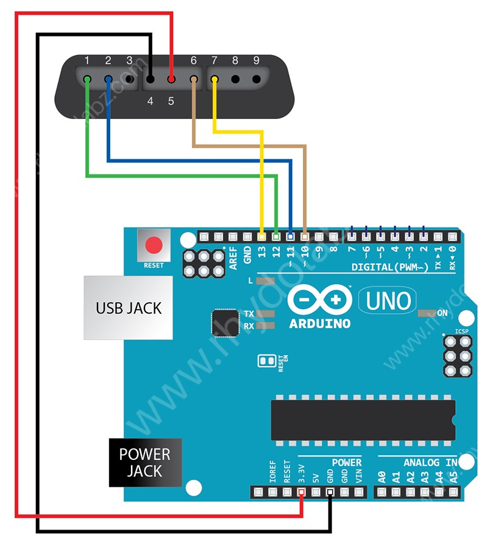

# PS2 controller for the robot

Download the PS2X_lib.zip file. Then go to "Sketch > Include Library > Add .ZIP Library..." and include the library.

After successfull import you will be able to open "File > Examples > PS2X_lib > Examples > PS2X_Example". Upload to your arduino, connect the wires and you should recieve the values from your remote.

The example uses the pins 10 to 13.

It does work with Arduino Uno R3, but not with Arduino Leonardo since the USB host is not transferring the serial data back.

We change the pins because 10 to 13 is used for the motor shield. New assignment:

| Pin PS2 | old  | new  |
|---------|------|------|
| 1       | 12   | 9    |
| 2       | 11   | 8    |
| 3       |      |      |
| 4       | GND  | GND  |
| 5       | 3.3V | 3.3V |
| 6       | 10   | 7    |
| 7       | 13   | 6    |
| 8       |      |      |
| 9       |      |      |
