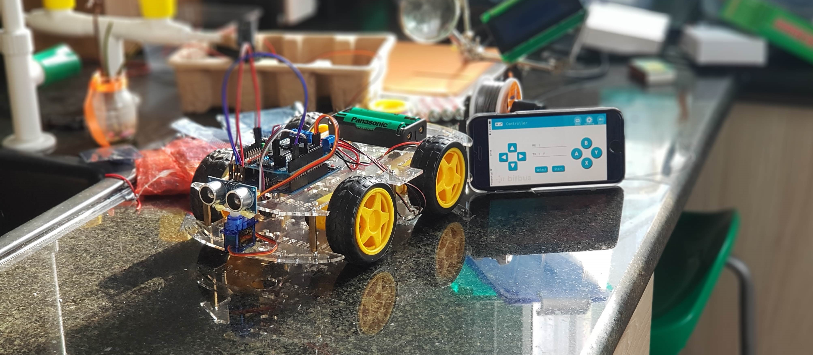
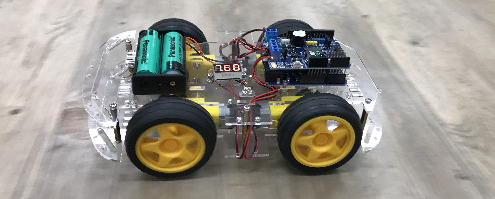
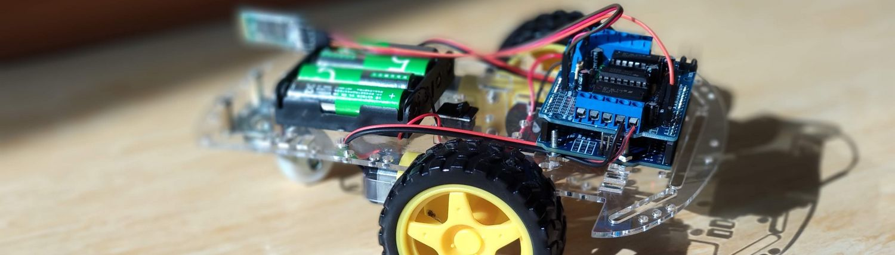

# ASA Robotics, IoT and Programming
This is an ASA After School Activity at the AISVN from fall 2019. It includes Robotics, IoT and Programming.

## Hardware

We ordered the following materials at [CỬA HÀNG IC ĐÂY RỒI](https://icdayroi.com/) for all students to have a common ground for further experiments both in software and hardware:

1. [Arduino Leonardo](https://icdayroi.com/arduino-leonardo-r3) (because of the Micro-USB interface) 125.000₫
2. [Khung xe robot 4 bánh](https://icdayroi.com/khung-xe-robot-4-banh) (4 wheels - stable driving) 140.000₫
3. [Arduino Motor Shield L298](https://icdayroi.com/arduino-motor-shield-l298) 120.000₫
4. [Module thu phát bluetooth HC-05](https://icdayroi.com/module-thu-phat-bluetooth-hc-05) 80.000₫
5. [Pin Cell 18650 4200mAh 3.7V](https://icdayroi.com/pin-cell-18650-4200mah-3-7v) (4 AA batteries are not enough for motor and bluetooth, and not rechargable) 35.000₫
6. [Hộp đế pin 18650 loại 2 cell](https://icdayroi.com/hop-de-pin-18650-loai-2-cell) battery holder for two 18650 batteries 7.000₫
7. [Công tắc gạt MTS-103 3 trạng thái](https://icdayroi.com/cong-tac-gat-mts-103-3-trang-thai) power switch for the robot 5.500₫
8. [Đồng hồ đo Vôn (Volt) 3.5-30V](https://icdayroi.com/dong-ho-do-von-volt-3-5-30v) Voltage display to check the charge level of the battery 22.000₫
9. Four 10 cm cable 0.25 mm² to connect the motors to the shield ₫
10. Three female-male jumper wire to connect the bluetooth module to the Arduino (+3.3V, GND, RX)
11. So in general: some [jumper wires](https://icdayroi.com/bo-day-cam-test-board-65-soi) 19.000₫
12. Maybe [a breadboard](https://icdayroi.com/testboard-mini-syb-170) to connect 5.000₫

All in all some 550.000₫ are already spend on these simple materials. Further steps include the collaborative project of a self driving robot ([Khung xe robot omni đa hướng](https://icdayroi.com/khung-xe-robot-omni-da-huong) 2.250.000₫), controlled by an [Raspberry Pi](https://thegioiic.com/products/raspberry-pi-4-model-b-2gb) 1.580.000 VND with [Camera](https://thegioiic.com/products/camera-8mp-imx219-160-degree-fov) 305.000 VND for object detection and obstacle avoidance.

## Building steps

* Assemble the robot
* Connect the motors to M1 and M4 on the L293D shield
* Connect the bluetooth module pin TXD to pin 8 of the motorshield

#### Software iOS
* Upload [bluetooth-robot_iOS.ino](./bluetooth-robot_iOS.ino) to your Arduino Leonardo
* Install [BitBlue](https://apps.apple.com/us/app/bitblue/id1403675953) from the Appstore. (ZOIT Sung_Han Lee Bitbus Inc.)
* Connect to "Turboshaft" and start driving!

#### Software Android
* Upload [bluetooth-robot_Android.ino](./bluetooth-robot_Android.ino) to your Arduino Leonardo
* Install [BLE joystick](https://play.google.com/store/apps/details?id=iyok.com.blejoystick&hl=en_US) on your phone/tablet.
* Connect to "Caterpillar" and start driving!

#### Software general
* Upload [bluetooth-remote-motor-1.ino](./bluetooth-remote-motor-1.ino) to your Arduino Leonardo
* Install [Arduino Bluetooth Controller](https://play.google.com/store/apps/details?id=com.giumig.apps.bluetoothserialmonitor&hl=en) on your Android smartphone
* Connect to the bluetooth module
* Configure the controller to send:
  - "U" for up/forward
  - "D" for down/backward
  - "L" for left turn
  - "R" for right turn
  - "0" for stop
  - "T" for turbo
  - "M" for medium
  - "S" for slow
 * Have fun!

## Pin assignment bluetooth

The motorshield uses the pins 10 and 12 for motor 1 and 11 and 13 for motor 2.
Digital pins: 12 and 13.
Analog pins: 10 and 11. Well, that's PWM.

| pin | general |       used for     | pin | general | used for |
|:---:|:-------:|:------------------:|:---:|---------|:--------:|
| 0   |    RX   |                    |  A0 |         |          |
| 1   |    TX   |                    |  A1 |         |          |
| 2   |         | ultrasonic trigger |  A2 |         |          |
| 3~  |         |  ultrasonic echo   |  A3 |         |          |
| 4   |         |        buzzer      |  A4 |         |          |
| 5~  |         |                    |  A5 |         |          |
| 6~  |         |                    |     |         |          |
| 7   |         |                    |     |         |          |
| 8   |         | bluetooth receive  |     |         |          |
| 9~  |         |       servo        |     |         |          |
| 10~ |         |         E1         |     |         |          |
| 11~ |         |         E2         |     |         |          |
| 12  |         |         M1         |     |         |          |
| 13  |   LED   |         M2         |     |         |          |

As for PWM: Leonardo offers 3, 5, 6, 9, 10, 11 and 13 as PWM pins. A total of 7. For speed control we need only 2.

## Pin assignment PS2 controller

The motorshield uses the pins 10 and 12 for motor 1 and 11 and 13 for motor 2.
Digital pins: 12 and 13.
Analog pins: 10 and 11. Well, that's PWM.

The original PS2 (wireless) controller used the same pins and have to be redifined to avoid collision. Here is the new pin assignment.

| pin | general |      used for     | pin | general | used for |
|:---:|:-------:|:-----------------:|:---:|---------|:--------:|
| 0   |    RX   |    Bluetooth RX   |  A0 |         |          |
| 1   |    TX   |    Bluetooth TX   |  A1 |         |          |
| 2   |         |                   |  A2 |         |          |
| 3~  |         |                   |  A3 |         |          |
| 4   |         |                   |  A4 |         |          |
| 5~  |         |                   |  A5 |         |          |
| 6~  |         |   PS2 Clock (7)   |     |         |          |
| 7   |         | PS2 Attention (6) |     |         |          |
| 8   |         |  PS2 Command (2)  |     |         |          |
| 9~  |         |    PS2 Data (1)   |     |         |          |
| 10~ |         |         E1        |     |         |          |
| 11~ |         |         E2        |     |         |          |
| 12  |         |         M1        |     |         |          |
| 13  |   LED   |         M2        |     |         |          |

As for PWM: Leonardo offers 3, 5, 6, 9, 10, 11 and 13 as PWM pins. A total of 7. For speed control we need only 2.

### New pins:

6, 7, 8, 9 for PS2 remote control
10, 11 PWM for motor 1 and 2
12, 13 enable for motor 1 and 2

## Inspiration

This is the old T100 robot that served as inspiratin for the new 4 wheel robot with Bluetooth BLE control and the new motorshield and the PS2 wireless analog controller.

